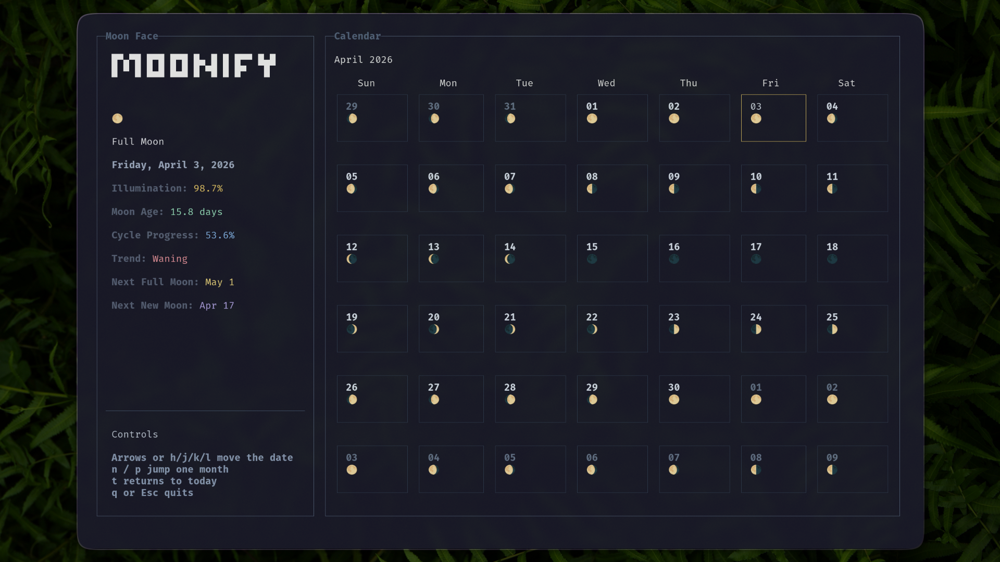

# Moonify

## Terminal Moon Phase Calendar



---

`Moonify` is a terminal UI app built with Open TUI. It shows a moon phase calendar, lets you move across dates with the keyboard, and displays moon phase details for the selected day in a sidebar.

## Requirements

- `bun`
- a terminal with decent Unicode/emoji support

## Install from npm

```bash
bun i -g @esyt/moonify
```

## Install helper script

If Bun is not installed yet on Linux or macOS, use the helper script in this repo. Use the bun package for windows.

```bash
curl -fsSL https://raw.githubusercontent.com/ESHAYAT102/moonify/main/install.sh | bash
```

## Run

```bash
moonify
```

## Controls

- Arrow keys or `h/j/k/l` move the selected date
- `n` / `p` jump forward or backward by one month
- `t` jumps back to today
- `q` or `Esc` exits

## Features

- Interactive calendar navigation with arrow keys or `h/j/k/l`
- Moon phase sidebar with phase name, illumination, moon age, cycle progress, and trend
- Upcoming full moon and new moon estimates

## Accuracy

Moonify uses an approximate lunar phase calculation based on:

- a known reference new moon
- the average synodic month length (`29.53058867` days)

That makes it good for:

- casual moon phase browsing
- a visual terminal calendar
- approximate date-based moon phase lookup

It is not intended for:

- observatory use
- exact astronomical event timing
- precision ephemeris work

## Notes

- Moon phase data is **approximate** not extremely accurate.
- The layout is tuned for terminal use and works best when the terminal is not extremely short.
- If the terminal is too small, Moonify shows a resize warning instead of rendering a broken UI.
